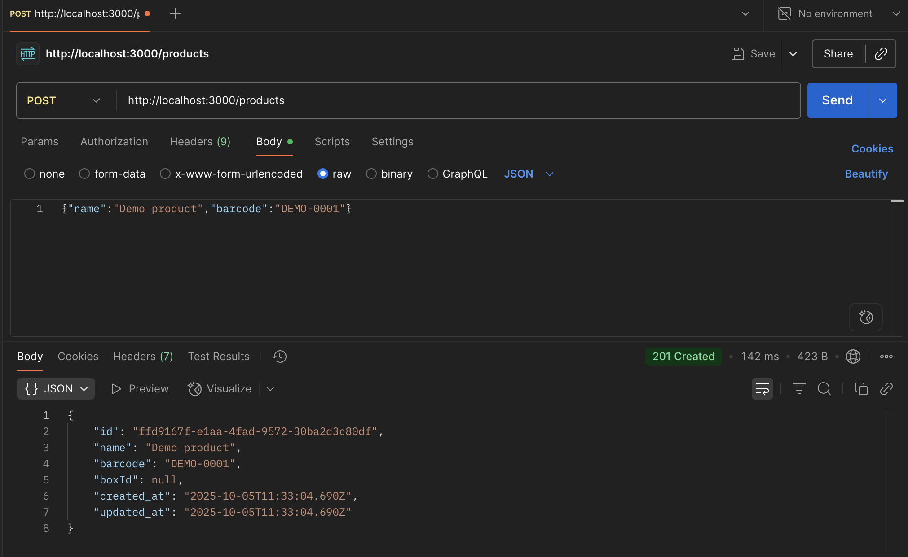

# Brama-Partners-Boxify — Backend

## Overview
This project implements a robust backend service for managing **Products** and **Boxes**, ensuring proper relations, adherence to business rules, transactional integrity, and well-documented APIs. It provides a foundation for inventory and logistics management.

## Features
- **Product Management**: CRUD operations for products with unique barcodes.
- **Box Management**: CRUD operations for boxes with unique labels and status transitions.
- **Product-Box Relationship**: Products can be assigned to only one box at a time.
- **Business Rule Enforcement**: Strict validation for box modifications and status transitions (e.g., adding/removing products only in `CREATED` status, valid status flow `CREATED → SEALED → SHIPPED`).
- **Transactional Operations**: Ensures data consistency for multi-table operations like creating boxes with products or adding/removing products.
- **Comprehensive API Endpoints**: RESTful API for all core functionalities, including pagination, searching, and sorting.
- **Robust Error Handling**: Standardized error responses for various scenarios (e.g., validation, not found, conflict, invalid transitions).
- **API Documentation**: Integrated Swagger/OpenAPI for interactive API exploration and documentation.
- **Rate Limiting**: Implemented to protect against abuse and ensure service stability.
- **Unit Tests**: Comprehensive unit test coverage for core services.
- **Dockerized Database**: Easy setup of PostgreSQL using Docker Compose.

## Implementation Status

### Implemented Features
- [x] Core Entities (Product, Box) definition
- [x] Basic CRUD for Products (`POST /products`, `GET /products`, `PATCH /products/:id`)
- [x] Basic CRUD for Boxes (`POST /boxes`, `GET /boxes`, `GET /boxes/:id`, `PATCH /boxes/:id` for label/status)
- [x] Pagination & Query Parameters (`limit`, `offset`, `search`, `sort_by`, `direction`)
- [x] Box status transitions: Enforce `CREATED → SEALED → SHIPPED` flow.
- [x] Transactions for multi-table operations (e.g., box creation with products)
- [x] Box modifications: Restrict add/remove products to `CREATED` status only.
- [x] Robust Error Handling (400, 404, 409, 422, 500 responses)
- [x] Swagger/OpenAPI Documentation
- [x] Docker Compose for PostgreSQL setup
- [x] Comprehensive Unit Tests for services

### Pending Features / To Be Confirmed
- [ ] Rate Limiting (100 req/min/IP for GET, 30 req/min/IP for others)
- [ ] Redis for caching counters/queries

## Local setup

1. Install dependencies:
   ```bash
   npm install
   ```

2. Create an `.env` file in the project root with:
   ```bash
   PORT=3000

   DB_HOST=localhost
   DB_PORT=5432
   DB_USER=user
   DB_PASSWORD=password
   DB_NAME=boxify

   # TypeORM
   DB_SYNC=true   # set false in production
   DB_LOGGING=true
   ```

3. Start PostgreSQL via Docker Compose:
   ```bash
   docker compose up -d
   ```

4. Run the app (dev):
   ```bash
   npm run start:dev
   ```

The API will be available at `http://localhost:3000`.

## Product endpoints (MVP)

- **POST `/products`**
  
  

- **GET `/products?limit=5&offset=0&search=demo&sort_by=created_at&direction=desc`**
  
  

- **PATCH `/products/:id`**
  
  

## Box endpoints

- **POST `/boxes`** — create box with products (transactional)
- **GET `/boxes`** — list with pagination, filters, sorting
- **GET `/boxes/:id`** — box details with products
- **PATCH `/boxes/:id`** — update label or status
- **POST `/boxes/:id/products`** — add products (only if CREATED)
- **DELETE `/boxes/:id/products`** — remove products (only if CREATED)
- **DELETE `/boxes/:id`** — delete box (only if CREATED)

## Pagination & Query Parameters
API endpoints that support listing (e.g., `GET /products`, `GET /boxes`) utilize the following query parameters:
- `limit`: Number of items per page (e.g., `?limit=20`)
- `offset`: Offset for pagination (e.g., `?offset=0`)
- `search`: Keyword for searching (e.g., `?search=demo`)
- `sort_by`: Field to sort by (e.g., `?sort_by=created_at`)
- `direction`: Sorting direction (`asc` or `desc`, e.g., `?direction=desc`)

**Response Example:**
```json
{
  "data": [...],
  "pagination": { "limit": 20, "offset": 0, "total": 123 }
}
```

## Business Rules
Key business rules enforced by the system:
1.  A product can belong to **only one box** at a time.
2.  Box modifications (add/remove products) are allowed **only in `CREATED` status**.
3.  Valid box status transitions: `CREATED → SEALED → SHIPPED`.
4.  Box deletion allowed **only if status = `CREATED`**.
5.  Transactions are used for multi-table operations (e.g., box creation with products, adding/removing products).

## Error Handling
The API provides consistent error responses:
- `400 Bad Request`: Validation errors.
- `404 Not Found`: Resource not found.
- `409 Conflict`: Business rule violation.
- `422 Unprocessable Entity`: Invalid status transition.
- `500 Internal Server Error`: Unexpected server errors.

## Documentation
Interactive API documentation is available via **Swagger/OpenAPI** at `/api` (e.g., `http://localhost:3000/api`) when the application is running.

## Bonus Features
- **Rate Limiting**:
  - `GET` requests: 100 requests/minute/IP
  - `POST`/`PATCH`/`DELETE` requests: 30 requests/minute/IP
  - Responses for exceeding limits include `429 Too Many Requests` with `Retry-After` and `X-RateLimit-*` headers.
- **Redis**: Used for caching counters/queries.
- **Unit Tests**: Comprehensive unit tests for core services.
- **Docker Compose**: Simplifies database setup (PostgreSQL).

## Project Structure (Recommended)
```
src/
 ├── modules/
 │    ├── products/
 │    └── boxes/
 ├── common/
 │    ├── filters/
 │    ├── interceptors/
 │    ├── decorators/
 │    └── utils/
 ├── database/
 └── main.ts
```